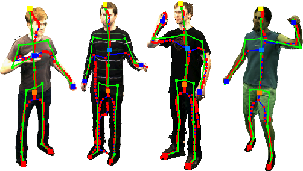

# Exercise Guidance with PoseNet

This project leverages the PoseNet model to provide visual guidance for various exercises, ensuring correct posture. Users can select an exercise from a set of icons, and the system will monitor their movements, giving real-time feedback on whether the exercise is performed correctly.

## Features

- Real-time posture detection using PoseNet.
- Visual feedback on exercise correctness.
- Supports multiple exercises including squats, push-ups, jumps, lunges, hand stretching, side stretching, and wrist rotation.

## Technologies Used

- **HTML**: For structuring the web page.
- **CSS**: For styling the web page and making it visually appealing.
- **JavaScript**: For adding interactivity and implementing the PoseNet model.
- **ml5.js**: A friendly high-level interface to TensorFlow.js, used here for the PoseNet model.
- **p5.js**: A JavaScript library that makes coding accessible for artists, designers, educators, and beginners.

## PoseNet Model Preview

Below is a preview of the PoseNet model in action, as used in this project for real-time posture detection:

<p align="center">
  
</p>

PoseNet helps identify key points on the human body to evaluate and guide posture during exercises like squats, push-ups, and more.

## Setup

1. Clone the repository:
    ```bash
    git clone https://github.com/ESSADEQAziz/exercise-guidance-posenet.git
    ```
2. Navigate to the project directory:
    ```bash
    cd exercise-guidance-posenet
    ```
3. Open the `index.html` file in your web browser.

## Usage

1. Select an exercise from the available icons.
2. Allow access to your webcam when prompted.
3. Perform the selected exercise in front of the camera.
4. Receive real-time feedback on your posture.

## File Structure

- `index.html`: The main HTML file that structures the web page.
- `styles.css`: The CSS file for styling the web page.

- `sketch.js`: The JavaScript file containing the main logic for PoseNet integration and exercise feedback.
- `icons/`: Directory containing icons for each exercise.
